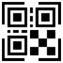
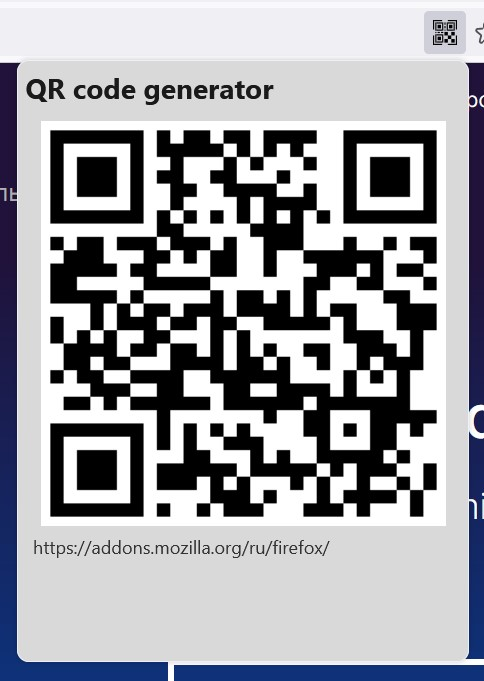

</img>
# QR code generator
  

## Описание
QR code generator – расширение для браузера Firefox, которое добавляет в адресную строку кнопку создания QR-кода для открытой вкладки и позволяет быстро открыть эту же вкладку на телефоне или другом устройстве. 

## Скачать

## Скриншоты

